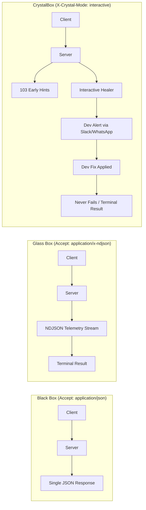

# @allascode.institute/aon

[](https://www.npmjs.com/package/@allascode.institute/aon)
[](./LICENSE)
[](./docs/AONP.md)
[](#)
[](https://github.com/suissa/AllasCode-AON)

> **Adaptive Observability Negotiation Protocol (AONP v1.0.0)** and **CrystalBox Interactive Runtime Healing** engine for Agentic AI backends and modern HTTP APIs.  
> **A foundational pillar of the AllasCode Architecture, Framework & Platform, published by [AllasCode.Institute](https://github.com/suissa/AllasCode-AON).**

`@allascode.institute/aon` transforms traditional opaque "Black Box" APIs into transparent, observable, and self-healing systems. It enables clients—such as Autonomous AI Agents, LLM toolcall executors, SRE dashboards, and web applications—to dynamically negotiate execution observability over a single HTTP connection using standard Content Negotiation (RFC 7231).

---

## 🏛️ AllasCode Architecture Integration

The **AllasCode Architecture** is an advanced paradigm for autonomous, intent-driven, zero-trust, and collaborative agentic systems. In the AllasCode vision:

1. **APIs are not static pipes**: They are adaptive interfaces capable of cognitive intent disambiguation and active runtime self-healing.
2. **Transparent Cognition**: Autonomous agents and human supervisors need visibility into intermediate execution steps without breaking standard HTTP contracts.
3. **Collaborative Resilience (CrystalBox)**: When autonomous healing exhausts its thresholds, execution does not simply fail—it enters an interactive human-in-the-loop state to resolve anomalies collaboratively.

`@allascode.institute/aon` serves as the universal observability and runtime healing foundation across the entire AllasCode ecosystem.

---

## 🌟 Key Features

- **Adaptive Content Negotiation (RFC 7231)**: Seamlessly switch between standard JSON payloads and real-time telemetry streams using the standard `Accept` header.
- **Glass Box Streaming (NDJSON)**: Emit line-delimited JSON events (`status`, `intent_analysis`, `healing`, `result`, `error`) with immediate `200 OK` chunked transfer.
- **❄️👁️ CrystalBox Mode**: Interactive, bidirectional observability with `103 Early Hints`, `102 Processing`, and collaborative human-in-the-loop intervention.
- **Two-Tier Human-in-the-Loop**: Specialized `Human-Dev-in-the-loop` (technical infrastructure alerts via Slack/WhatsApp) and `Human-User-in-the-loop` (business risk decisions).
- **Runtime Self-Healing**: Transparently execute recovery routines (token refresh, database pool recovery, rate limit backoff, schema validation fixes) before bubbling errors.
- **Zero Runtime Dependencies**: Powered entirely by the Node.js standard library (`node:http`, `node:crypto`). Compatible with native `http`, Express, Fastify, Connect, and Hono.
- **Dual ESM / CommonJS**: Fully typed with TypeScript declarations (`.d.ts` and `.d.cts`).

---

## 🔍 Observability Modes Comparison



| Feature | Black Box Mode | Glass Box Mode | ❄️👁️ CrystalBox Mode |
| :--- | :---: | :---: | :---: |
| **Request Header** | `Accept: application/json` | `Accept: application/x-ndjson` | `X-Crystal-Mode: interactive` |
| **Response Type** | Single JSON Body | Streamed NDJSON (`\n`) | Interactive Streamed NDJSON |
| **Intermediate Telemetry** | ❌ None | ✅ Real-time Chunks | ✅ Real-time Chunks |
| **Automated Self-Healing** | ✅ Silent | ✅ Emitted in Stream | ✅ Emitted in Stream |
| **Human-in-the-Loop** | ❌ No | ❌ Passive Observation | ✅ **Bidirectional Intervention** |
| **HTTP Status Preload** | ❌ No | ❌ Standard 200 OK | ✅ **103 Early Hints & 102 Processing** |
| **Legacy Client Safety** | ✅ 100% Compatible | ✅ Opt-in via Header | ✅ Opt-in via Header |

---

## 🚀 Quick Start

### Installation

```bash
npm install @allascode.institute/aon
```

### Basic Server Usage (Express / Connect)

```typescript
import express from 'express';
import { aonMiddleware, withAON } from '@allascode.institute/aon';

const app = express();

// 1. Register AON middleware globally
app.use(aonMiddleware({
  enabled: true,
  productionDetailLevel: 'standard',
  healingTimeout: 10000
}));

// 2. Wrap your route handler with AON capabilities
app.get('/api/v1/users/:id', withAON(async (req, res, writer, healer) => {
  writer.status('Connecting to database replica...', 120);

  // Simulate automated healing if an issue occurs
  await healer.heal(
    'recover_db_connection',
    'Primary database connection reset, switching to replica pool',
    { replica: 'us-east-1b' }
  );

  writer.status('Fetching user profile...');

  // Returning an object automatically writes the terminal 'result' event in streaming mode,
  // or dispatches standard res.json() in Black Box mode!
  return {
    id: req.params.id,
    name: 'Ada Lovelace',
    tier: 'enterprise'
  };
}));

app.listen(3000, () => {
  console.log('Server running on http://localhost:3000');
});
```

---

## 📡 Consuming from Clients

### 1. Traditional REST Client (Black Box)

```bash
curl -H "Accept: application/json" http://localhost:3000/api/v1/users/123
```
**Response:**
```json
{
  "id": "123",
  "name": "Ada Lovelace",
  "tier": "enterprise"
}
```

### 2. Autonomous Agent / Streaming Consumer (Glass Box)

```bash
curl -N -H "Accept: application/x-ndjson" http://localhost:3000/api/v1/users/123
```
**Response Stream (Line by Line):**
```json
{"type":"status","timestamp":1773539400000,"message":"AON stream initialized - Glass Box mode active"}
{"type":"status","timestamp":1773539400050,"message":"Connecting to database replica...","estimated_delay_ms":120}
{"type":"healing","timestamp":1773539400180,"severity":"medium","action":"recover_db_connection","description":"Primary database connection reset, switching to replica pool","metadata":{"replica":"us-east-1b"}}
{"type":"status","timestamp":1773539400210,"message":"Fetching user profile..."}
{"type":"result","timestamp":1773539400260,"data":{"id":"123","name":"Ada Lovelace","tier":"enterprise"}}
```

---

## ❄️👁️ CrystalBox Mode: Interactive Runtime Healing

Enable interactive collaborative self-healing with `X-Crystal-Mode: interactive`:

```typescript
import { crystalBoxMiddleware, withCrystalBox, requestInteractiveHealing } from '@allascode.institute/aon';

app.use(crystalBoxMiddleware());

app.post('/api/v1/checkout', withCrystalBox(async (req, res) => {
  try {
    return await executePayment(req.body);
  } catch (error) {
    if (error.code === 'GATEWAY_TIMEOUT') {
      // Escalates to developer on-call via WhatsApp/Slack and holds connection with 102 Processing
      const resolved = await requestInteractiveHealing(
        req,
        'gateway_timeout_fallback',
        'Primary gateway unresponsive, switch to secondary processor?',
        { provider: 'stripe', attempt: 3 }
      );

      if (resolved) {
        return await executePaymentWithSecondary(req.body);
      }
    }
    throw error;
  }
}));
```

---

## 📜 Official Specifications & RFCs

`@allascode.institute/aon` is the canonical reference implementation of the following open standards:

- [RFC-0001: Adaptive Observability Negotiation Protocol (AONP v1.0.0)](./docs/AONP.md)
- [RFC-0004: Observability Modes & CrystalBox Specification](./docs/Observability.modes.md)
- [RFC-0005: Interactive Runtime Healing Specification (IRH)](./docs/InteractiveHealing.md)
- [ADR-0001: Zero Runtime Dependencies Architecture](./docs/adr/0001-zero-runtime-dependencies-core.md)
- [Ubiquitous Glossary (Domain Model)](./CONTEXT.md)

---

## 🤝 Contributing

Contributions are welcome! Please read our [Contributing Guide](./CONTRIBUTING.md) and [Code of Conduct](./CODE_OF_CONDUCT.md).

We use Jujutsu (`jj`) and Git colocated repositories, and run tests with Node.js native test runner:

```bash
git clone git@github.com:suissa/AllasCode-AON.git
cd AllasCode-AON
jj git init --colocated
npm install
npm run typecheck
npm test
npm run build
```

---

## 📄 License

[MIT](./LICENSE) © 2026 [AllasCode.Institute](https://github.com/suissa/AllasCode-AON) & Contributors
