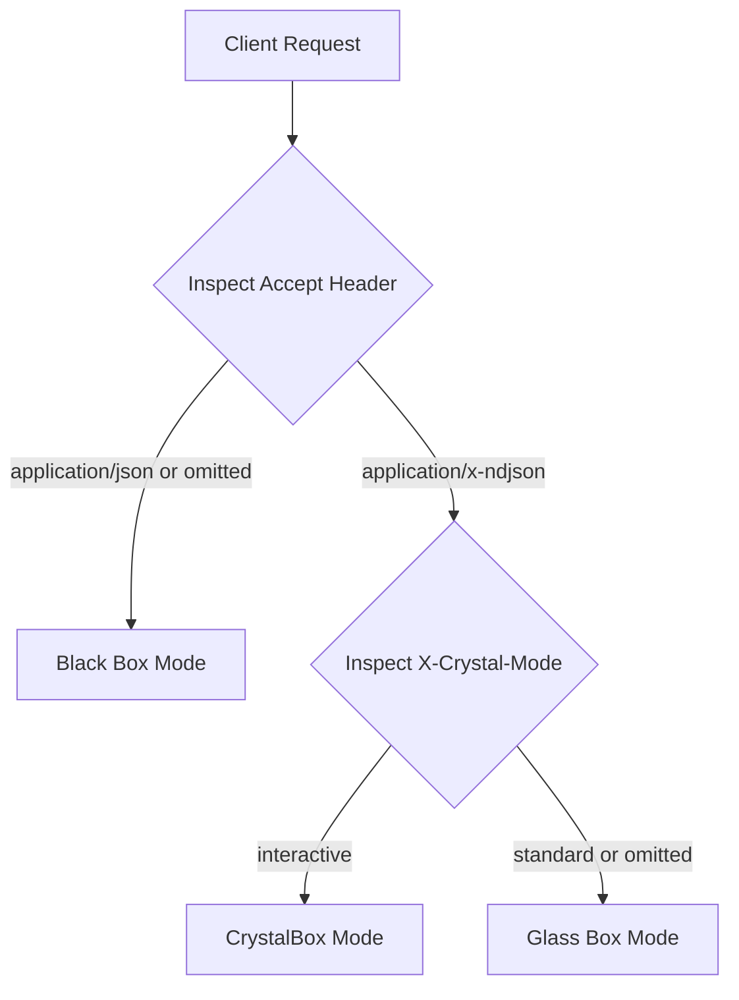
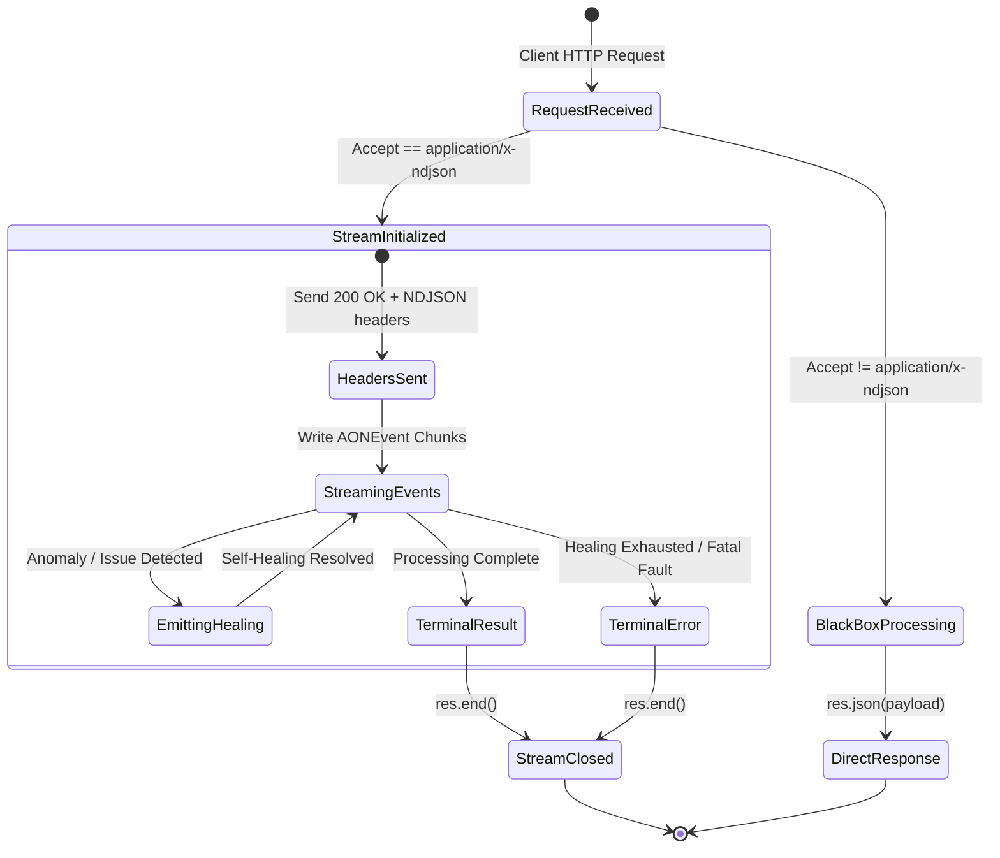

# RFC-0001: Adaptive Observability Negotiation Protocol (AONP)

- **Specification**: Adaptive Observability Negotiation Protocol (AONP)
- **Status**: Standard / Stable
- **Version**: 1.0.0
- **Date**: 2026-09-14
- **Context**: AllasCode Architecture
- **Pattern Type**: Architectural / Communication Protocol
- **RFC Class**: Standards Track

---

## 1. Conformance and Terminology

The key words "MUST", "MUST NOT", "REQUIRED", "SHALL", "SHALL NOT", "SHOULD", "SHOULD NOT", "RECOMMENDED", "NOT RECOMMENDED", "MAY", and "OPTIONAL" in this document are to be interpreted as described in BCP 14 [RFC 2119] [RFC 8174] when, and only when, they appear in all capitals, as shown here.

---

## 2. Abstract

The Adaptive Observability Negotiation Protocol (AONP) defines an architectural specification and HTTP communication protocol for RESTful and Agentic APIs. AONP enables clients—such as Autonomous AI Agents, Agentic Orchestrators, Developer Dashboards, and traditional Web/Mobile Applications—to dynamically negotiate the granularity, transport, and interactivity of execution observability on a per-request basis.

Unlike traditional APIs that operate strictly as opaque "Black Boxes" (returning only a terminal payload or error after processing completes), AONP allows the server to operate in "Glass Box" (streaming real-time telemetry, heuristic decisions, and self-healing interventions) and "CrystalBox" (interactive bi-directional runtime healing with Human-in-the-loop / Human-Dev-in-the-loop capabilities), over the same standard HTTP connection.

---

## 3. Motivation and Problem Statement

In modern software systems driven by Intent-Driven Development (IDD) and Autonomous AI Agents:
1. **Dynamic Execution Durations**: Latency varies non-deterministically when backends execute autonomous healing routines (e.g., token refreshes, schema validation repairs, semantic payload adaptation, exponential backoff retries, connection failover).
2. **The "Silent Healing" Paradox**: Traditional APIs either block silently during healing—causing clients to assume a hang or timeout—or swallow non-fatal self-healing actions, preventing developers and orchestrators from learning about systemic regressions.
3. **Agentic Context Deprivation**: Autonomous agents consuming traditional endpoints lack intermediate context. Without telemetry, an agent cannot understand *why* an operation was delayed or *how* an intent was remapped.

AONP resolves these challenges by using standard HTTP Content Negotiation (RFC 7231) to establish an adaptive contract without breaking backward compatibility with existing HTTP consumers.

---

## 4. Protocol Specification

### 4.1. Handshake & Content Negotiation (Request)

A client signals its desired observability level via the standard HTTP `Accept` header and optional mode headers.



#### 4.1.1. Black Box Mode (Standard REST)
- **Target Audience**: Legacy HTTP clients, web browsers, traditional third-party API consumers.
- **Request Header**: `Accept: application/json` (or omitted).
- **Server Requirement**:
  - The server MUST process the request internally without emitting intermediate telemetry chunks.
  - Non-fatal healing events MAY be buffered in memory and surfaced in an optional response header: `X-AON-Report: count=<n>;healed=<action>`.
  - The final response MUST be a standard single JSON document with appropriate HTTP status codes (`200 OK`, `400 Bad Request`, `500 Internal Server Error`, etc.).

#### 4.1.2. Glass Box Mode (Agentic Passive Streaming)
- **Target Audience**: AI Agents, LLM toolcall executors, automated pipelines, observability dashboards.
- **Request Header**: `Accept: application/x-ndjson`.
- **Server Requirement**:
  - The server MUST initiate an immediate HTTP 200 OK response with chunked transfer encoding:
    ```http
    HTTP/1.1 200 OK
    Content-Type: application/x-ndjson
    Transfer-Encoding: chunked
    Connection: keep-alive
    Cache-Control: no-cache, no-transform
    ```
  - The server MUST stream JSON objects separated by newline characters (`\n`).
  - Every event MUST conform to the AONP Event Schema (§5).
  - The stream MUST terminate with exactly one terminal event (`result` or `error`), followed by connection closure (`res.end()`).

#### 4.1.3. CrystalBox Mode (Interactive Observable Healing)
- **Target Audience**: Collaborative AI Agent workflows, Mission-Critical SRE pipelines, Human-in-the-loop / Human-Dev-in-the-loop environments.
- **Request Headers**:
  ```http
  Accept: application/x-ndjson
  X-Crystal-Mode: interactive
  ```
- **Server Requirement**:
  - The server MAY send `103 Early Hints` with preloaded dependencies or critical telemetry pointers before the primary response stream.
  - The server MUST stream NDJSON events as in Glass Box mode.
  - When encountering unrecoverable automated failures, the server MUST emit an `interactive_healing_request` event and hold the connection within a configurable `healingTimeout` window while dispatching notifications to human responders (via Webhook, Slack, WhatsApp) or supervisor agents.

---

## 5. Event Data Structures (NDJSON Schema)

Every event sent over an AONP stream MUST be serialized as a single-line JSON object followed by `\n` (U+000A).

### 5.1. Base Event Structure

```typescript
export interface AONBaseEvent {
  type: string;          // Discriminator
  timestamp: number;     // Unix Epoch Milliseconds
  requestId?: string;    // Distributed Trace / Request Correlation ID
}
```

### 5.2. Core Event Types

#### 5.2.1. `status` (Heartbeat & Progress)
Emitted periodically to indicate background activity, prevent client timeouts, and report elapsed/estimated latency.
```json
{
  "type": "status",
  "timestamp": 1773539400000,
  "requestId": "req_8f1b2c3d",
  "message": "Resolving upstream payment gateway...",
  "estimated_delay_ms": 350
}
```

#### 5.2.2. `intent_analysis` (Cognitive Intent Disambiguation)
Emitted when an agentic router or parser interprets ambiguous input and applies heuristic remapping.
```json
{
  "type": "intent_analysis",
  "timestamp": 1773539400120,
  "requestId": "req_8f1b2c3d",
  "original_intent": "checkout_order",
  "detected_issue": "missing_currency_field",
  "decision": "inferred_currency_from_user_locale_BRL"
}
```

#### 5.2.3. `healing` (Automated Self-Healing Action)
Emitted when the server autonomously remediates a runtime failure (token expiration, rate limit, schema mismatch, failover).
```json
{
  "type": "healing",
  "timestamp": 1773539400450,
  "requestId": "req_8f1b2c3d",
  "severity": "medium",
  "action": "refresh_token",
  "description": "Upstream OAuth token expired; renewed via refresh grant.",
  "metadata": {
    "attempt": 1,
    "max_attempts": 3,
    "provider": "auth_service"
  }
}
```

Valid `severity` levels MUST be one of: `"low" | "medium" | "high" | "critical"`.

#### 5.2.4. `result` (Terminal Success)
The final event in a successful stream. MUST be followed immediately by connection termination.
```json
{
  "type": "result",
  "timestamp": 1773539400890,
  "requestId": "req_8f1b2c3d",
  "data": {
    "order_id": "ord_994821",
    "status": "confirmed",
    "total": 149.90
  }
}
```

#### 5.2.5. `error` (Terminal Failure)
Emitted when all healing heuristics and retries have been exhausted. MUST be the final event before connection termination.
```json
{
  "type": "error",
  "timestamp": 1773539401200,
  "requestId": "req_8f1b2c3d",
  "code": "UPSTREAM_GATEWAY_UNAVAILABLE",
  "message": "All 3 connection retry attempts failed.",
  "trace_id": "trace_x99a71b2"
}
```

---

## 6. Connection Lifecycle State Machine



---

## 7. Implementation Guidelines

### 7.1. Server Middleware Pattern
- The AON middleware MUST intercept the standard response dispatch mechanism (`res.json()`, `res.send()`).
- If in streaming mode (`isStreaming === true`), the payload passed to `res.json(payload)` MUST be encapsulated into an `AONResultEvent` (`{ type: "result", data: payload }`), written as an NDJSON line, and ended.
- If in black box mode, incoming telemetry events MUST NOT be written to the socket.

### 7.2. Client Parser Pattern
- Consumers of Glass Box / CrystalBox streams MUST read chunked streams using an NDJSON buffer that handles partial chunk boundaries (splits occurring across TCP frames).
- Each valid line parsed MUST be dispatched to the consumer application event handlers.

---

## 8. Security Considerations

1. **Information Disclosure Prevention**:
   - Telemetry emitted during `healing` or `intent_analysis` MUST be sanitized.
   - Credentials, plain-text authorization tokens, raw database connection strings, and PII MUST NOT be emitted in event `metadata` or `description`.
2. **Denial of Service (DoS) Protections**:
   - Servers MUST enforce `maxTelemetryEvents` (default RECOMMENDED: 1000 per request) to prevent unbounded memory usage or network saturation.
   - Servers MUST enforce a strict `healingTimeout` (default RECOMMENDED: 15000 ms in development, 5000 ms in production) to prevent hung client sockets.
3. **Environment Profiles**:
   - Production profiles SHOULD throttle internal diagnostic details for unauthenticated requests, restricting fine-grained trace logs to authenticated operators.

---

## 9. Conformance Checklist

A server implementation is conformant with **AONP v1.0.0** if and only if it satisfies all of the following:

- [x] **RFC-C1**: Accurately negotiates `Accept: application/json` vs `Accept: application/x-ndjson` without breaking legacy clients.
- [x] **RFC-C2**: Emits standard MIME type `application/x-ndjson` with `Transfer-Encoding: chunked`.
- [x] **RFC-C3**: Formats all streaming events as valid, single-line JSON objects terminated with `\n`.
- [x] **RFC-C4**: Guarantees that every stream concludes with exactly one terminal event (`result` or `error`).
- [x] **RFC-C5**: Implements at least one automated self-healing action (`healing` event) prior to emitting a terminal `error`.
- [x] **RFC-C6**: Enforces credential sanitization across all emitted event payloads.
